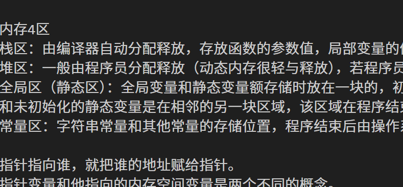

数组做函数参数，传递的是数组的首地址。
正确的做法是把数组的内存首地址和数据的有效长度传给被调用函数。
形参中的数组，编译器会把它当成指针，避免数据的拷贝，提高效率。

数据类型
- 简单类型 
    - 基本类型
        - 整型/浮点型/字符型/空类型
    - 用户定义类型
        - 枚举类型
- 结构类型
    - 数组/结构/联合/类
- 指针类型

数据类型的本质是固定大小内存的别名，编译器预算对象（变量）分配的内存空间大小.

变量的本质是一段连续内存空间的别名（是一个门牌号）

void无类型，不存在void类型的变量， void * 无类型指针，void *可以指向任何类型的数据,void*指针作为右值赋值给其它指针时需要强制类型转换，void*指针作为左值用于接收任意类型的指针。

内存4区
栈区：由编译器自动分配释放，存放函数的参数值，局部变量的值等。
堆区：一般由程序员分配释放（动态内存很轻与释放），若程序员不释放，程序结束时可能由操作系统回收。
全局区（静态区）：全局变量和静态变量额存储时放在一块的，初始化的全局变量和静态变量在一块区域，未初始化的全局变量和未初始化的静态变量是在相邻的另一块区域，该区域在程序结束后由操作系统释放。
常量区：字符串常量和其他常量的存储位置，程序结束后由操作系统释放。

指针指向谁，就把谁的地址赋给指针。
指针变量和他指向的内存空间变量是两个不同的概念。

