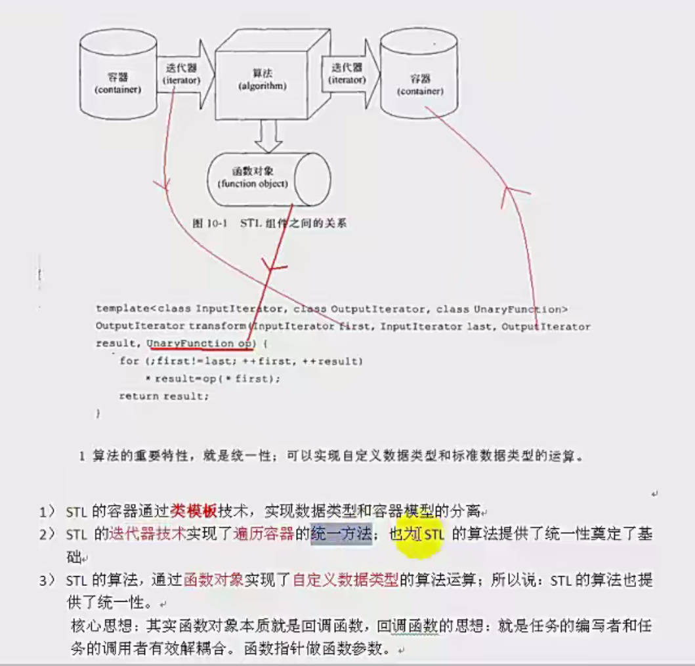

所有容器提供的都是值语义，而非引用语义。容器执行插入元素的操作时，内部实施拷贝动作。所以STL容器内存储的元素必须能够被拷贝（必须提供拷贝构造函数，重载=操作符）；

每个容器都提供了一个默认的构造函数和一个默认的拷贝构造函数，如已有容器vector<int> vA;vector<int> vB(vA);

分清楚stl算法返回的值是迭代器 还是谓词（函数对象） 是stl算法入门的重要点

标准库提供一组函数适配器，用来特殊化或者扩展一元和二元函数对象，常用适配器是：
1.绑定器：把二元函数对象的一个实参绑定到一个特殊值上，将其转换成一元函数对象。bind1st和bind2nd
2.取反器：将函数对象的值翻转的函数适配器，not1翻转一元预定义函数对象的真值，not2翻转二元谓词函数的真值

1.STL容器通过类模板技术，实现数据类型和容器模型的分离
2.STL的迭代器技术实现了遍历容器的统一方法；也为STL的算法提供了统一性奠定了基础。
3.STL的算法，通过函数对象实现了自定义数据类型的算法运算；所以说：STL的算法也提供了统一性
核心思想：其实函数对象本质就是回调函数，回调函数的思想：就是任务的编写者和任务的调用者有效解耦合。函数指针做函数参数。
4.具体例子：transform算法的输入，通过迭代器fist和last指向的元素作为输入；通过result作为输出；通过函数对象来做自定义数据类型的运算。